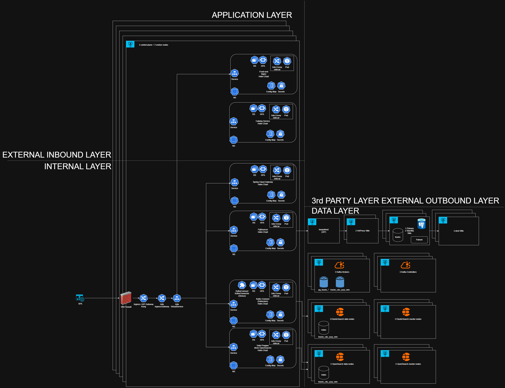

# Music CDC Stack (Kafka KRaft + Debezium + ES/OpenSearch + Spring Boot)

Sets up:
- Kafka (KRaft quorum: 3 controllers, 3 brokers), Connect, Schema Registry (Avro).
- PostgreSQL managed by **Liquibase** (schema, monthly partitions, publication, per-connector signal tables).
- Debezium CDC connectors with **distinct DLQ topics** and **per-partition signal tables** to trigger manual snapshots.
- Elasticsearch and OpenSearch sinks with **distinct DLQs**.
- Spring Boot (JDK 25) search API with 2 endpoints (no auth for now).




## Why Liquibase here?
- Best practice for production: migrations are versioned and automated via CI/CD. The API is only a query layer; indexing is done by Kafka Connect sinks, so Liquibase runs as a separate migrator service (not inside the query API) to keep responsibilities clean. This mirrors large-scale setups where data pipelines and application services are decoupled.

## Prerequisites
- Docker and Docker Compose.
- Java 25 + Maven (to build the custom SMT, optional).
- Create apicurio DB, open it in pgAdmin, and then create the user using the following:
```sql
CREATE DATABASE apicurio;

CREATE USER apicurio WITH PASSWORD 'secret';
GRANT ALL PRIVILEGES ON DATABASE apicurio TO apicurio;
GRANT USAGE ON SCHEMA public TO apicurio;
GRANT CREATE ON SCHEMA public TO apicurio;
ALTER DEFAULT PRIVILEGES IN SCHEMA public GRANT ALL ON TABLES TO apicurio;
```
- Generate certs in `kafka/certs` folder, via `cert-generator/docker-compose.yml`. See `README.md` from `cert-generator` for more details.

## Build custom SMT (optional)
```bash
cd plugins/custom-smt
mvn -q -DskipTests package
cd ../..
Ensure plugins/custom-smt/target/custom-smt-0.1.0.jar exists (mounted to Connect).
Start the stack
docker compose up -d
Liquibase will apply DB migrations before Kafka Connect starts.
Create connectors
# Debezium CDC

curl -s -X POST http://localhost:8083/connectors -H "Content-Type: application/json" \
  --data @connect-configs/debezium-tracks-2025-12.json

curl -s -X POST http://localhost:8083/connectors -H "Content-Type: application/json" \
  --data @connect-configs/debezium-tracks-2026-01.json

# Elasticsearch sinks

curl -s -X POST http://localhost:8083/connectors -H "Content-Type: application/json" \
  --data @connect-configs/es-sink-2025-12.json

curl -s -X POST http://localhost:8083/connectors -H "Content-Type: application/json" \
  --data @connect-configs/es-sink-2026-01.json

# OpenSearch sinks
curl -s -X POST http://localhost:8083/connectors -H "Content-Type: application/json" \
  --data @connect-configs/opensearch-sink-2025-12.json

curl -s -X POST http://localhost:8083/connectors -H "Content-Type: application/json" \
  --data @connect-configs/opensearch-sink-2026-01.json
Create indices (optional mapping)
Elasticsearch:
curl -X PUT "http://localhost:9200/tracks" -H 'Content-Type: application/json' -d '{
  "settings": { "index": { "number_of_shards": 1, "number_of_replicas": 0 } },
  "mappings": { "properties": {
    "track_id": { "type": "long" },
    "title":    { "type": "text" },
    "artist":   { "type": "text" },
    "album":    { "type": "text" },
    "duration_ms": { "type": "integer" },
    "recorded_at": { "type": "date", "format": "date_time" }
  } }
}'
OpenSearch:
curl -X PUT "http://localhost:9201/tracks" -H 'Content-Type: application/json' -d '{
  "settings": { "index": { "number_of_shards": 1, "number_of_replicas": 0 } },
  "mappings": { "properties": {
    "track_id": { "type": "long" },
    "title":    { "type": "text" },
    "artist":   { "type": "text" },
    "album":    { "type": "text" },
    "duration_ms": { "type": "integer" },
    "recorded_at": { "type": "date", "format": "date_time" }
  } }
}'
Search API
•	Elasticsearch: GET http://localhost:8080/search/es?q=Artist
•	OpenSearch: GET http://localhost:8080/search/opensearch?q=Song
Trigger manual re-index via Debezium signal tables
Partition 2025_12 snapshot:
docker exec -it postgres psql -U appuser -d musicdb -c \
"INSERT INTO public.debezium_signal_tracks_2025_12 (id, type, data)
 VALUES ('sig-2025-12-001', 'execute-snapshot',
 '{\"data-collections\": [\"public.tracks_2025_12\"], \"type\":\"INCREMENTAL\"}');"
Partition 2026_01 snapshot:
docker exec -it postgres psql -U appuser -d musicdb -c \
"INSERT INTO public.debezium_signal_tracks_2026_01 (id, type, data)
 VALUES ('sig-2026-01-001', 'execute-snapshot',
 '{\"data-collections\": [\"public.tracks_2026_01\"], \"type\":\"INCREMENTAL\"}');"
Distinct DLQs per connector
•	Debezium CDC: _dlq_pg_2025_12, _dlq_pg_2026_01
•	ES sinks: _dlq_es_2025_12, _dlq_es_2026_01
•	OpenSearch sinks: _dlq_os_2025_12, _dlq_os_2026_01
Production notes
•	Enable TLS, SASL/SCRAM, ACLs for Kafka, Connect REST, Schema Registry, and PostgreSQL.
•	Manage secrets outside compose (vaults), use least privilege in publications and connectors.
•	Govern Avro schemas with compatibility rules; review schema changes.
•	Monitor DLQ growth, connector task failures, Kafka ISR, and Postgres slot lag.

---

# Liquibase vs Spring Boot for migrations

- **Best practice:** Keep schema lifecycle independent of the query API. Use Liquibase as a separate migrator (as in this compose) or via CI/CD pipelines. This aligns with large-scale setups where CDC, indexing, and query services are decoupled.
- **When to put Liquibase in Spring Boot:** If the API owns the schema and needs to evolve it alongside code. Here, the API only queries indexed data; schema pertains to ingestion and CDC. Keeping Liquibase separate avoids coupling release cycles and reduces risk.
- **Operational flow:** Apply Liquibase migrations before starting or altering any Debezium connectors. This ensures new partitions and signal tables exist before CDC tasks run.

If you prefer Liquibase inside Spring Boot, I can add the dependency and a changelog to the API module.

